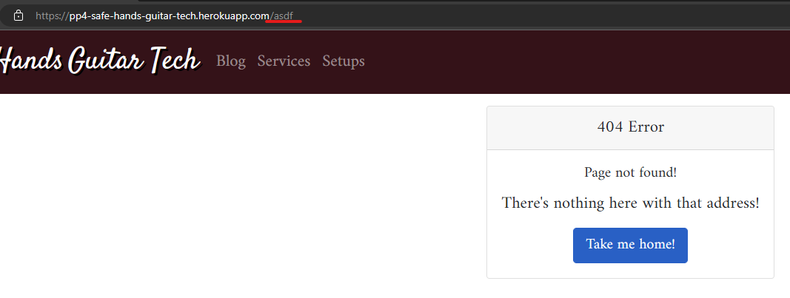
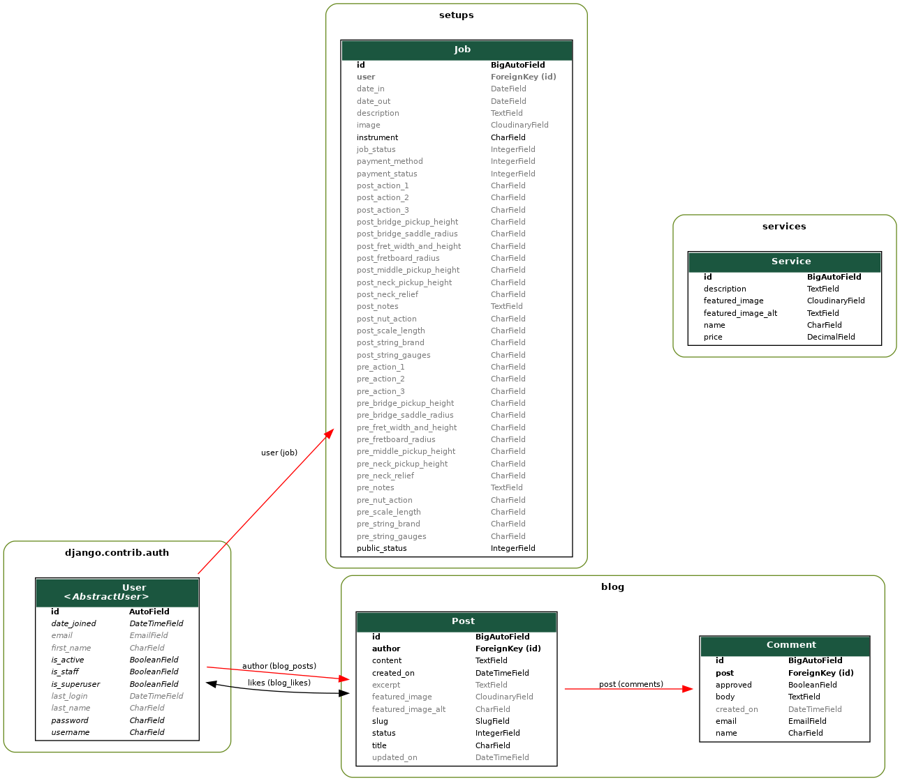

# Safe Hands Guitar Tech Website


[Click here to view the deployed site!](https://pp4-safe-hands-guitar-tech.herokuapp.com/)

<details>
  <summary>Click to reveal QR code for easy mobile access!</summary>
  
</details>

## Introduction

Welcome to the documentation for Safe Hands Guitar Tech! Here we will take an
in-depth look at the process undertaken to deliver the project, from inception
to deployment.

The project is a database-backed Model-View-Template (MVT) full-stack application,
powered by the Django framework. This is similar to the [MVC](https://developer.mozilla.org/en-US/docs/Glossary/MVC)
design pattern. The excellent [MDN Django Tutorial](https://developer.mozilla.org/en-US/docs/Learn/Server-side/Django/Introduction)
outlines the Django MVT pattern as follows:


This application allows for Create, Read, Update and Delete (CRUD) functions. At
the heart of this is the Model, or representation of the database tables. Django
interacts with the database by way of an [Object Relational Mapping (ORM),](<https://www.freecodecamp.org/news/what-is-an-orm-the-meaning-of-object-relational-mapping-database-tools/#:~:text=Object%20Relational%20Mapping%20(ORM)%20is,(OOP)%20to%20relational%20databases.>) that connects Django's Python code to the
relational database used for storing the site's back-end data.

We will examine in-depth how the Models for the site were constructed. In short,
Python code is used to create custom objects, which Django converts to [Structured Query Language (SQL)](<https://aws.amazon.com/what-is/sql/#:~:text=Structured%20query%20language%20(SQL)%20is,relationships%20between%20the%20data%20values.>)
commands that the configured relational database uses to construct its tables.

## Agile methodologies

[Agile methodologies](https://www.atlassian.com/agile) were used across the full
development cycle. This is a project management approach that breaks the project
down into phases, with well-defined, weighted tasks to complete in the given
period. It emphasizes continuous improvement through a refining process and has
the flexibility to welcome change if it meets the goals of the project.

Practice of agile methodologies has been evidenced using GitHub's built-in tools.
Namely, the Issues, Milestones and Projects systems. The level of decomposition
for agile items, from biggest to smallest are:

1. Epics - An overarching collection of stories to implement a feature, or collection of features
2. User stories - Stories told from the perspective of a certain user of the site. What do they want and why?
3. Tasks - The actual work that must be undertaken to fulfill the user story
4. Acceptance criteria - An objective metric to assess the completion of a user story

Here is the breakdown of the tools available on GitHub to present each agile
component.

- [Issues](https://github.com/jts272/pp4-safe-hands-guitar-tech/issues) is where
  each individual agile item is created, often using an issue template. First, an
  Epic is defined which states a big feature of the project too large to be broken
  down. Stories are then created from different perspectives that clarify what
  users actually want. Each story is given a set of tasks to be done to make the
  story happen, and acceptance criteria to test their validity.

- [Milestones](https://github.com/jts272/pp4-safe-hands-guitar-tech/milestones)
  are used as collections of agile items. For example, milestones are created for
  each iteration, which is a timeboxed period where certain stories are planned to
  be completed. As a best-practice, timeboxes do not contain more than 60% of their
  items as 'should have' on the [MoSCoW priority level system.](https://en.wikipedia.org/wiki/MoSCoW_method)
  Milestones are also used to hold [Product Backlog Items (PBIs),](https://github.com/jts272/pp4-safe-hands-guitar-tech/milestone/1)
  which is where items are stored before being passed to a given iteration.

- [Projects](https://github.com/jts272/pp4-safe-hands-guitar-tech/projects?query=is%3Aopen)
  are utilized as information radiators for an instant view on an iteration's progress.
  These are best viewed in Board view with the Label field enabled. Here is the
  board for the [first iteration](https://github.com/users/jts272/projects/7/views/1?layout=board&visibleFields=%5B%22Title%22%2C%22Assignees%22%2C%22Status%22%2C%22Labels%22%5D)
  as an example. This follows the kanban style whereby an item is brought in as
  a Todo item. It then moves to In Progress when it is being worked on, then
  finally Done once all tasks and acceptance criteria have been met.

Below is an example index card for an item found on the project board:


We see that it is a designated story with a title. Each story is linked to an
Epic. This example shows a user story from the perspective of the site admin -
what they want to do and how it will benefit them. We then see the tasks that
must be completed to bring this story to fruition. The acceptance criteria are
tests that must pass to meet the definition of done.

In the right-hand panel, labels are visible for the MoSCoW priority level and
a story point (SP) estimation. These are estimates of effort, assigned using a
[modified Fibonacci](https://www.mountaingoatsoftware.com/blog/why-the-fibonacci-sequence-works-well-for-estimating) weighting scale.
The milestone or timebox the issue belongs to is shown, as well as its status.

Note that Done items are moved by GitHub to the [closed](https://github.com/jts272/pp4-safe-hands-guitar-tech/issues?q=is%3Aissue+is%3Aclosed)
category. This is the same for completed [iterations](https://github.com/jts272/pp4-safe-hands-guitar-tech/milestones?state=closed)

Agile practices help both the developers and product owners. The goals are always
visible, along with the tasks required to achieve them. By using these tools, the
needs of the users are always put first, which guides development to its essential
target. I invite you to explore each milestone to see what was achieved.

---

## Five stages of UX design

The five stages of user experience (UX) design is the pattern that was employed
to bring this project's vision to life. Starting with high-level business needs,
it drills down to the specifics of the what, why and how of each required element
found in the final product.

### 1. Strategy

This project is built from the perspective of a small business owner who wants a
website to attract customers to his [Guitar Tech](https://en.wikipedia.org/wiki/Guitar_tech)
business. The owner will also function as the site's admin for CRUD functions
relating to blog posts, services and setup jobs. The site operates on B2C model,
whereby the product owner advertises his services to private customers.

To meet its business needs, the site needs to display certain information.
Visitors would expect to instantly get an impression of what the site is about
on first glance, with intuitive navigation. Service prices need to be easy to
find. Furthermore, the site content needs to be engaging enough to retain viewership
and help to grow the business.

As the key stakeholder, I conducted an existing product audit on the following sites:

- [Northwest Guitars](https://northwestguitajackrs.co.uk/)
- [Jim's Guitar Workshop](https://jimsguitarworkshop.co.uk/)
- [Fraser Callum](https://fcstrings.com/)

This informed me of scope expectations, which are explored in the next stage of
design.

### 2. Scope

The first objective of scope is to work out the [Minimum Viable Product (MVP)](https://www.productplan.com/glossary/minimum-viable-product/) so that there is a clear set of goals to bring a working
product to market. This is intertwined with the agile methodologies outlined
previously, which adds varying perspectives to the needs of the project.

A blog was to be included from the beginning. This helps to build trust and
engagement for users. They can see that the owner knows their trade and maps
common guitar-related scenarios to jobs he can help with. Users can engage in
the conversation with comments and likes. For this, relevant content must be
produced for site visitors.

Naturally, the services on offer must be detailed, with prices included. This
feature was designed to be easily updated by the owner in the event that prices,
service details or even available services changes.

The [Unique Selling Point (USP)](https://en.wikipedia.org/wiki/Unique_selling_proposition)
of this application is the setups section. Here, the owner can proudly display
their work on past customers' instruments, with a detailed specification breakdown.
This offers a unique value proposition as an app within the project, which requires
a highly customized data model.

A testimonials section for registered customers had been considered early on,
similar to that of [Fraser Callum's.](https://fcstrings.com/testimonials/)
However, I had decided to focus on the blog, service information and the unique
setup feature as I believed these features would have the biggest impact.

As a final functional requirement, there must be a way for customers to contact
the owner to book in their service. This is achieved through the contact buttons
at the footer of every page. An email contact form had been considered, although
on inspection, it would have required setup in Django beyond the scope of the
three iterations allotted to this project.

By examining the [Project Boards](https://github.com/jts272/pp4-safe-hands-guitar-tech/projects?query=is%3Aopen)
and [Milestones,](https://github.com/jts272/pp4-safe-hands-guitar-tech/milestones?state=closed)
a clear link between project scope and deliverable items is seen. As an example,
the first iteration was geared towards achieving MVP blog functionality. The
second focussed on customer/business features. Agile keeps scope creep at bay,
with a clear focus on the essentials. The end result of this approach is a product
that meets the needs of the business, whilst being concise enough for visitors
to navigate fluently.

### 3. Structure

Structure concerns organization of site functions. This is represented in the
concept of [Information Architecture (IA).](https://www.usability.gov/what-and-why/information-architecture.html)
This translates to providing the user with key information where they are, what
they can do and what to expect. This is encapsulated by the implementation of
strong [Interaction Design (IXD),](<https://www.interaction-design.org/literature/topics/interaction-design#:~:text=Interaction%20Design%20(IxD)%20is%20the,output%20to%20suit%20precise%20demands.>)
whereby features are implemented with consideration for _how_ they will be used.

Key components of IXD employed are intuitive navigation, that never requires
guesswork from the user. Feedback is delivered on all actions, from form validation
to success messages.

User's expectations are met whilst browsing through the use of templates. In other
words, elements like navigation and footers stay consistent across pages, with
relevant page content in the middle. A common pattern Django is great for is that
of list-view to detail-view. Put simply, a user finds a list of records on a
given topic, which they can click to access a more detailed view of that record.
This pattern is utilized to great effect in the blog and setups sections.

In keeping with intuitive navigation, errors are handled gracefully, whether client
or server-side. Examples include 404 error handling or presence testing a model
for content and reacting accordingly. Both examples are explored in their relevant
features section.

### 4. Skeleton

In the skeleton phase, we give form to function by way of the User Interface (UI).

Navigation is the first concern when a user visits the site. The brand name is
the first feature, which follows convention by serving as a link home. Then follows
the sections for blog, services and setups.

This tells a story in that the user reads a blog post that catches their interest.
From there they decide to check out the service prices. Then they can check records
of past services from satisfied customers.

On the far side of the navbar is authentication information. A first-time user
can clearly see that account registration is a feature - the gateway to interaction
with the site's content.

From the moment the visitor first lands on the page, they instantly gain an impression
of what the site is about. A familiar image of a Fender Stratocaster greets them.
A bullet-pointed list shows key jobs that are undertaken by the business owner.

An accordion invites user interaction - do they identify with one of the use-cases
and could they benefit from the services on offer? This is followed by a brief
text summary of the key points to visit on the site and why the visitor might
want to go there. Finally an invitation is made to get in contact using the
social call-to-action (CTA) buttons.

The following section highlights the five most recent blog posts, with counters
for likes and comments. This lets users know there is room for interaction. A
brief excerpt is show to capture their attention for reading the specific blog
post in full.

The following wireframe mock ups were constructed to visualize how this information
may appear on the screen. One of the design philosophies implemented was that of
[Mobile First,](https://www.browserstack.com/guide/how-to-implement-mobile-first-design)
which considers the smaller screen before the larger one. In this approach, the
elements are displayed in such a way that mobile users do not have to compromise
on content. From there, the elements can be positioned in such a way that they
can take advantage of ever-increasing screen sizes.

The mockups here target a desktop view, as this presents the information in a more
straightforward way. In the mobile view, elements stack vertically with no loss
of information.

<details>
  <summary>Homepage</summary>
  
</details>

<details>
  <summary>Services</summary>
  
</details>

<details>
  <summary>List view for Blog and Setups</summary>
  
</details>

<details>
  <summary>Blog detail</summary>
  
</details>

<details>
  <summary>Setups detail</summary>
  
</details>

Wireframe images were produced with [draw.io desktop](https://github.com/jgraph/drawio-desktop/releases/)

### 5. Surface

The surface stage concerns the details of how the above elements are presented
to the user. This involves the 'look-and-feel' and ultimately, whether the product
feels valuable. Let's examine each practical element's rationale.

#### Colour


Colour palette image generated at [coolors.co](https://coolors.co/palettes/trending)

I chose to keep things very simple for colours. As stated in Peter Kent's
[SEO for Dummies,](https://www.goodreads.com/book/show/4077.Search_Engine_Optimization_for_Dummies?ac=1&from_search=true&qid=i1EHL1RSSR&rank=1)
'Google likes black text on a white background'. As this site is text-heavy I wanted
to keep things legible and let the content do the talking.

I chose a deep red, which is the business owner's brand colour. Red is classically
associated with guitars, as evidenced in the sites from the existing product audit;
not to mention [Fender's](https://www.fender.com/en-GB/start) website.

[Bootstrap 4 colours](https://getbootstrap.com/docs/4.6/utilities/colors/#background-color)
were used on semantic navigational buttons. Deletion actions were coloured red,
for example. Slight adjustments were made in CSS to ensure these elements met
acceptable contrast ratios. Sadly, they do not meet these standards out-of-the-box.

#### Typography

Two fonts were used on the site. [Satisfy](https://fonts.google.com/specimen/Satisfy?query=satisfy)
is a cursive font, for a handwritten feel on the brand name, such that might be
used if the guitar tech was writing notes. This was given a drop shadow effect
to add depth.

A serif font, [Amiri,](https://fonts.google.com/specimen/Amiri?query=amiri) was
used for all other text content. I had originally intended to use
[Palatino Linotype,](https://learn.microsoft.com/en-us/typography/font-list/palatino-linotype#style--weight-examples)
however this was not available as a Google Font, which is great for use in web design.
The Amiri font exudes an air of experience and knowledge, making for a pleasant,
book-like reading experience. Of note is that serif fonts aid in [reducing fatigue](https://www.ncbi.nlm.nih.gov/pmc/articles/PMC4612630/#:~:text=%E2%80%9CSerifs%20have%20an%20important%20role,the%20location%20of%20stroke%20ends.)
when reading large sums of text.

#### Imagery

Stock image sites such as [Pexels](https://www.pexels.com/) and [Freepik](https://www.freepik.com/)
were used to capture some of the web-friendly quality images used on the site.

The hero image instantly captures the attention of guitar players of any level,
whilst blog posts are adorned with featured images to illustrate their point.

Images on the setups section were take from the business owner's personal
collection, using an iPhone camera.

Of note is that all images uploaded to the site feature dynamic alt tags for
assistive technologies. This is achieved through either direct input at the
image capturing phase (such as in the admin panel), or is generated by model
methods as seen for the images in the setups section.

#### Text content

All blog content has been written by the owner for display on the site. For a
similar example, see [Jim's Guitar Workshop Blog](https://jimsguitarworkshop.co.uk/blog/)

Service content was drafted by the owner to outline his current services and prices.

Setup specification content is also carefully captured by the owner to show the
before-and-after states of his work.

#### Responsive design

These elements culminate in a fully responsive, accessible package to present
all desired information to the user. UX testing has shown a great response to
the deployed design on different devices, with user feedback suggestions implemented
where possible. One such example is directing the user to points of contact for
the business owner.

---

## Features

In this section, the implemented features of the site are explored in more detail.
Where there are notable differences, both the desktop and mobile versions are presented.

### Navigation

#### Desktop navbar and hero image


The navbar includes the brand. This links home in all pages. Links to the three
main sections of the site follow. On the far side of the navbar are the authentication
controls, which always report the login status of the user.

#### Mobile navbar and hero image


In the mobile view, the brand text is reduced to avoid a layout shift. In this
example, the admin user is logged in. The hero image is fully responsive across
screen sizes

### Footer

#### Desktop footer


The footer features a tagline, social contact CTA's and a 'copyright' mark. In
mobile view, these three components are stacked

#### Mobile footer


### Homepage


The homepage displays introductory text to let the visitor know what the site is
about. A list shows some common services. An accordion is used to solicit some
interaction with the content to draw the potential customer in. Further below
are some brief highlights of the different sections of the site, and finally an
offer showing how to get in contact.

The right sidebar shows the five most recent blog posts. An excerpt invites the
reader to select a topic that they find intriguing.

### Blog

#### Desktop blog list


On entry of the blog section, the user is presented with a list view of blog posts.
These are paginated in groups of two, allowing full navigation across all published
blog posts. Like and comment counts are shown, as well as a link to read the topic
in full. A link home is provided for when the user is finished with this section

#### Mobile blog detail


A detailed view of the post includes the title, featured image and body text.

#### Desktop blog comments


At the end of the post, logged in users have access to the comment box where they
can leave a comment to be approved by the author. Also shown is the heart icon,
which users can click to like a post.

### Services


As the name suggests, the services are shown and have corresponding prices. A little
more detail is given on the nature of the job, with an accompanying image.

### Setups

#### Desktop setups list with permissions


Similar to the blog list view, this pattern is used for the setups section and
functions in the same manner. If logged in as an admin, the button to create a
new job is present.

#### Desktop setups detail top


#### Desktop setups bottom with permissions


The setups detail page is a long list of before and after specifications for the
guitar that has been worked on. This contains all the setup minutiae that is
covered in the Models section.

Admin has access to controls to update or delete the setup that is being viewed.

#### Setups form top


#### Setups form middle


#### Setups form bottom


The examples show the top, middle and bottom of the form, with controls to submit
the form at the bottom.

### Error pages

Browsing errors are handled gracefully, with an explanation of the issue and a link back home.
A status code 500 page has been implemented in the event of server error, which
follows the same format. The 403 page is shown in the section regarding authentication.

#### 404 error page



### Favicon


A favicon was created at [favicon.io.](https://favicon.io/) This consists of the
initials of the brand, in similar font and colouring.

### Feedback messages

Feedback is delivered at all times to the user. Login status is shown at all times
in the navbar, but more dynamic feedback is present too. These actions pertain to
logged-in users, which is covered in detail in the subsequent authentication section.
The Django messages system is utilized to provide feedback in the following ways:

#### Signed in


#### Sign out confirmation


#### Signed out


#### Setup created


#### Setup delete confirmation


#### Setup deleted


#### Comment pending


The comment pending message uses custom logic to display its message when the
user has left a post on a given comment.

---

## Authentication

The site implements role-based access to functions. This concerns two parties -
the business owner, or admin and the customers, or regular users. For site interaction
beyond browsing, an account is required. This is facilitated by the accounts and
registration system, powered by [django-allauth](https://django-allauth.readthedocs.io/en/latest/)

### Accounts and registration

These features work as expected. The user selects a unique username, email and
a password which they must confirm. They are then granted user-level access, allowing
them to leave likes and comments. Comments go through a pending approval process,
which allows the admin to filter any objectionable content before showing it on
the site.

#### Registration


#### Signing in


### Authentication in relation to CRUD functions

Authentication is a critical factor in this app. By design, the business owner
(hereby 'admin'), is in full control of the data shown on the site. This is
achieved through three means:

1. Having full control of comment approval in the admin panel
2. Creating, updating and deleting services on offer, including prices, in the admin panel
3. Creating, updating and deleting setup job records in the front end (or admin panel).

The first two points are, by their nature, password restricted for admin panel access.
As the third point pertains to the front end, special measures have been taken in
the Django code to prevent access to CRUD functions for unauthorized users, even
if the URL to access these functions is known.

Let's take an example of trying to create a job record as a logged out user. Firstly,
the buttons for CRUD functions are never rendered in the template unless the user
of the HTTP request has the correct permissions. If the user tries to brute-force
their way into a create view by way of URL path, they are prompted to log in:


If the user is logged in, but doesn't have permission, they are greeted to a custom 403 page:


This creates a clear separation between the admin and regular site users. An
account is required for regular users to leave likes and comments. However, the
admin user is in control of all business-related data.

---

## Data modelling

As mentioned at the beginning, Python code is used with the Django framework to
generate the tables in the provisioned database. This project uses a
[Postgres](https://www.postgresql.org/) database, hosted on [ElephantSQL.](https://www.elephantsql.com/)

### Custom models

The following graph shows the custom models that were created to facilitate the
MVT interaction of this application:



This graph was generated with the `graph_models` command, included with
[django_extensions.](https://django-extensions.readthedocs.io/en/latest/index.html)

Please see these additional [installation instructions](https://github.com/pygraphviz/pygraphviz/blob/main/INSTALL.txt)
if you would like to generate your own graph visualizations.

### How to read the graph

Each box with the dark green banner represents a table, or model. They are grouped
by app with the light green border. Bold text signifies a required field. The arrows
show the relational direction for foreign keys (FK), otherwise known as a [many-to-one](https://docs.djangoproject.com/en/3.2/topics/db/examples/many_to_one/)
field in Django parlance. Red coloured arrows outline the deletion cascade effect.
If the parent is deleted, it takes the child record with it. The fields generated
in the visualization are listed alphabetically after any primary and foreign keys.

#### User model

This is the standard user model that comes with Django, which forms the basis
for interactive content. This has been left unmodified

#### Services model

This model stands alone. It's function is to present service data, with corresponding
prices. The usage pattern is for the admin to enter values for all fields in the
table, so that they are shown on the services list page.

#### Blog - Post model

A blog post must have an author, which is a member of the User model. The `created_on`
fields is auto-generated when the author creates their post. The slug is a slugified
version of the title, so that this can be used for URL matching. Status is used
to mark a post as 'draft' or 'published', to enable post visibility.

#### Blog - Comment model

The FK here is the post on which the comment was made. Similarly to the `status`
field of the post, the `approved` field allows admin to determine which comments
are visible on the site.

#### Blog aside - Likes field

Not displayed on the graph is the `likes` field of a blog post. This is in fact
a [many-to-many](https://docs.djangoproject.com/en/3.2/topics/db/examples/many_to_many/)
field, with a relation to a given user. If a user likes the post, they are included
into this field. Django handles these relationships behind-the-scenes. For more
information, please see this [blog post](https://www.sankalpjonna.com/learn-django/the-right-way-to-use-a-manytomanyfield-in-django)
by Sankalp Jonna.

#### Setups - Job model

This model is the application's USP, which was heavily inspired by Dan Erlewine's
[How to Make Your Electric Guitar Play Great!: Second Edition;](https://www.goodreads.com/book/show/74448907-how-to-make-your-electric-guitar-play-great)
the author of which is considered to be one of the foremost authorities in
[Guitar Lutherie.](https://en.wikipedia.org/wiki/Luthier)
The model takes a before-and-after approach towards the business side and the
instrument specifics.

An instrument field is required to make the job record unique. This also has an
FK to a registered user, whom the instrument belongs to. Transactional information
includes dates in and out, payment method, payment status and job status. The job
status dynamically alters what information is visible in the template. For example,
there would be no 'after' information to display for a job that is 'todo'.

The other fields are specialized attributes of the given instrument, the explanation
of which is far beyond the scope of this model breakdown. The admin/business owner
would be adept at filling in each of these fields as required. Consider that many
guitars for example do not have a middle pickup, so these sorts of fields could
not be mandatory.

Not all fields are represented in the template, but are still present in the form
for data the owner may be interested in capturing, such as multiple action measurements.

#### Complete schema

Using [OOP](https://en.wikipedia.org/wiki/Object-oriented_programming) methods,
Django is able to generate a fully configurable relational database through
Python code. This integrates with authorization, templates and URL routing to
deliver a seamless experience for users.

For reference, here is the full application schema, including models built-in
with the `allauth` system for authenticating users:

<details>
  <summary>Full schema</summary>
  
</details>

---

## Testing

Testing was a key component of development. It ensures the integrity of the project.
Items to be tested included code, user stories and UI responsiveness.

Django has testing facilities utilizing Python unit tests, which is 'code to test
the code'. This ensures that the codes does what is expected, without breaking
if any changes are made in other parts of the codebase. Let's examine these
automated Python tests first. The code can be found within each app's `tests.py`
module.

### Python testing

A tool called [coverage](https://coverage.readthedocs.io/en/7.2.7/) was used to
assess what portions of the code required testing. As the majority of bigger features
used Django's built in class-based views, much of the testing of these sections
were already handled. Custom methods and overrides were the items that the
coverage report showed as needing additional testing.

Shown first are the results of automated tests, broken down per app. Below each
test result is the corresponding coverage report for the app.

#### Home app automated tests


#### Services automated tests


#### Blog app automated tests


#### Setups app automated tests


#### Coverage completion

Coverage is able to produce an interactive HTML report to show which tests are
not accounted for. Following this report, I had conducted manual tests on all
remaining code that was not covered with automated unit tests.

Please refer to this Google Sheet for [PP4 Manual Testing.](https://docs.google.com/spreadsheets/d/1rEmiXK6gaGRec36PTqSf-xvOvEL9AZAI3CMtfIvxsNw/edit#gid=0)
Inside you will find a clean breakdown by app, module, class and function or method.
I am happy to report that all remaining test items passed successfully.

### JavaScript testing

A small amount of custom JavaScript code was employed in this project, using the
jQuery library. This was used to do three things in the deployed app:

1. Set a timeout to dismiss Django messages after four seconds
2. To alter the class of arrow on an open or closed Bootstrap 4 accordion
3. To style a form submission button

| Test | Expected Result                                                                     | Actual Result                                                              | State |
| ---- | ----------------------------------------------------------------------------------- | -------------------------------------------------------------------------- | ----- |
| 1.   | Messages from the Django messages system auto-dismiss after four seconds            | The message box closes after four seconds have passed                      | Pass  |
| 2.   | Closed accordion arrows point right, then down when open                            | Accordion arrows point right when closed, the down when clicked and opened | Pass  |
| 3.   | The button should have Bootstrap 4 classes applied to resemble a large green button | btn, btn-lg and btn-success are applied to form a large green button       | Pass  |

### UX/story testing

To avoid repetition and keep related concerns together, the testing of user stories
has in fact been documented with each issue's index card. In the Agile methodologies
section, we see that each story has been given a set of acceptance criteria. These
are objective tests to assess the passing state of each story. Each acceptance criterion
must have passed before the issue can be closed to complete the story item.

Please refer to each iteration's [milestone,](https://github.com/jts272/pp4-safe-hands-guitar-tech/milestones?state=closed)
or [project board](https://github.com/jts272/pp4-safe-hands-guitar-tech/projects?query=is%3Aopen)
(in board-view with labels enabled) to assess the tests conducted for each user story.

### UI testing

Responsiveness of every element has been tested throughout development. The mobile-first
nature of the design process and Bootstrap 4 framework have facilitated this. This
is evidenced in the deployed project, whose clean UI never breaks at any size. There
is no compromise in detail displayed at any size.

Such key items tested for responsiveness include:

- Navbar and associated dropdown menu
- Footer item stacking
- All image cards, which unravel horizontally on desktop view
- All interactive button elements, which are appropriately spaced and never distort
- Appropriate use of screen width in list and detail views across resolutions

This was logged as a user story in the second iteration as 'Responsive site experience'
and was continuously refined throughout development. This should be readily apparent,
however you choose to view the site.

Through robust testing and supporting evidence, it is clear that the codebase is
solid and importantly, achieves its purpose. The code will be explored even further
in the next section on code validation.

---

## Validation

There are tools available to further assess the objective state of code standards.
The goal is to follow best practices in the code. This aids everybody: code collaborators
have an easier time working with existing code; users with accessibility needs can
fully interact with site content and SEO impact is maximized.

By following clean coding conventions and a well-configured coding environment,
we can achieve the best possible standards with our work. The results of each
language's validation checks are presented below.

### HTML validation

Tool: [Nu Html Checker](https://validator.w3.org/nu/)

[HTML validation reports](docs/images/validation/html/)

### CSS validation

Tool: [Jigsaw CSS Validation Service](https://jigsaw.w3.org/css-validator/)

[CSS validation reports](docs/images/validation/css/)

### JavaScript validation

Tool: [JSHint](https://jshint.com/)

[JavaScript validation reports](docs/images/validation/js/)

The undefined variable '$' is an artefact of validating the code without the
jQuery library present, which does not affect the validity of the scripts in use.

### Python validation

Python was validated in my coding environment. It was linted with [flake8](https://flake8.pycqa.org/en/latest/) and
[Pylance.](https://marketplace.visualstudio.com/items?itemName=ms-python.vscode-pylance)
Formatting was handled by [autopep8](https://pypi.org/project/autopep8/) and
[isort](https://marketplace.visualstudio.com/items?itemName=ms-python.isort) for
sorting imports.

I exercised my better judgement regarding [E501 warnings.](https://www.flake8rules.com/rules/E501.html)
As stated in [PEP8](https://peps.python.org/pep-0008/#a-foolish-consistency-is-the-hobgoblin-of-little-minds)
and [PEP20,](https://peps.python.org/pep-0020/) I have been consistent with my
styling in a way that maintains the best readability. For this reason, E501 messages
are present _exclusively_ for hyperlinks that break the 79 character line limit.
I have chosen to have a fully-functional intact links that are easily parsed by
human readers, for references given in-line. This will also be present in certain
settings files, mostly pre-generated by Django. These can just as easily be suppressed
on a per-line basis with the `# noqa` directive.

If you would like to manually assess the raw Python code, the contents of each
module can be pasted into the [CI Python Linter.](https://pep8ci.herokuapp.com/)

In instances where no problems are detected in the workspace, the editor window
with the open file in question is depicted. Where problems are present (either through
the aforementioned E501 message, or my integrated code spell-checker), the module
name is visible without having to show the open file.

[Python validation reports](docs/images/validation/python/)

### WAVE accessibility validation

Tool: [WAVE](https://wave.webaim.org/)

Accessibility is a core concern in every project I develop. Thankfully, the WAVE
tool generates alerts for anything that semantically or visually does not meet
accessibility standards. View the reports for each page on the site below:

[WAVE validation reports](docs/images/validation/wave/)

The WAVE tool is available as an extension for all major browsers.

### Lighthouse reports

Tool: DevTools Lighthouse in MS Edge InPrivate window

Lighthouse reports assess the site from a performance, accessibility and SEO perspective.
I have achieved 100/100 in the key metrics for accessibility, best practices and SEO.
I see no reason not to strive for this target, with the goal of reaching the widest
audience possible by objective metrics.

Performance could be improved by using different solutions regarding images, but
the site experience is smooth, without the presence of layout shift.

The reports have been saved in JSON format. To view the results, download and
drag 'n drop the file, or paste the raw code into the [Lighthouse Report Viewer](https://googlechrome.github.io/lighthouse/viewer/)

[Lighthouse JSON reports](docs/lighthouse/)

As with testing, validation was a key area that was constantly refined throughout
development. The code in production is clean, robust and meets all tested standards
to the highest degree.

---

## Version control

I follow [conventional commit](https://www.conventionalcommits.org/en/v1.0.0/)
habits that breaks down commits into small, well-defined chunks to aid the version
control process. Additional commit messages add extra context to commits where
necessary.

I had created an `experimental` branch as a scratchpad for trying out new methods,
however the main concern is the `main` branch.

The production code is free of commented-out or unused code that may have been
present at certain points of development. No secrets were exposed and all sensitive
data is stored on an untracked local file.

[Clean Code](https://www.goodreads.com/book/show/3735293-clean-code) by Robert C. Martin
(a.k.a. Uncle Bob) has been instrumental in how I think about naming all aspects of
my code in meaningful ways. I have named files, folders and functions semantically,
without using any cute abbreviations. Docstrings and comments are plentiful, whilst
also providing credit references inline, where I believe they are most appropriate.

To benefit anybody looking to fork this repository, I have included my
[djLint configuration file,](./pyproject.toml) if you would like to format `django-html`
files in the manner found within this project.

I have also included my VS Code [launch commands.](./.vscode/launch.json) I have
set up some common Django `manage.py` commands that you are free to run with just
a couple of clicks, with a debugger attached.

## Deployment

To follow these deployment steps, free accounts are required at the following sites:

- [GitHub](https://github.com/)
- [Heroku](https://id.heroku.com/login)
- [ElephantSQL](https://www.elephantsql.com/)

These steps are correct as of May 2023 and assumes you have active accounts and
and any relevant authentication systems setup for the above platforms. The IDE
used in these steps is VS Code for Windows, running WSL2 Ubuntu 20.04 LTS, in a
Python [virtual environment.](https://developer.mozilla.org/en-US/docs/Learn/Server-side/Django/development_environment#using_django_inside_a_python_virtual_environment)
The repository is initialized with GitHub's [Python .gitignore template.](./.gitignore)

**Do not push any changes to GitHub whilst secret keys are exposed!** A secret
key is generated with the `django-admin startproject` command. Take defensive
action early on and remove this from `settings.py` or add it to an untracked `env.py`
file. The secret key is required for Django to work, so handle with care.

### Early deployment steps

1. Install the [Heroku CLI](https://devcenter.heroku.com/articles/heroku-cli#other-installation-methods)
   and login in your IDE.
2. Install for the database adapter and webserver, then save the requirements:

```py
pip3 install psycopg2-binary
pip3 install gunicorn
pip3 freeze > requirements.txt
```

3. Create a new app on Heroku. Select a name and region. This can be done through
   the CLI or on the web.
4. Create a new database instance on ElephantSQL on the web. Select a name and
   region.
5. On the ElephantSQL dashboard, copy the database URL beginning with `postgres://`
   from the Details page
6. On Heroku, reveal the `Config Vars` on the settings of your app. Add the following
   variable with the URL provided by ElephantSQL:

```py
DATABASE_URL = <YOUR_ELEPHANTSQL_URL>
```

7. In your IDE, install a package to parse this URL and update your `requirements.txt`

```py
pip3 install dj-database-url
pip3 freeze > requirements.txt
```

8. Create a file called `env.py` in the root directory of your project. This file
   _must_ be added to the `.gitignore`. Add the following as on Heroku:

```py
import os


os.environ['DATABASE_URL'] = '<YOUR_ELEPHANTSQL_URL>'
```

9. In the `settings.py` module of the project directory, make sure it contains the following:

```py
import os
import env
import dj_database_url

DATABASES = {
    'default': dj_database_url.parse(os.environ.get('DATABASE_URL'))
}
```

Comment out the original `DATABASES` configuration; this is the local SQLite3 database.
You may want to keep this or assign it to a new variable for running tests later.

10. Run database migrations with `python3 manage.py migrate`
11. Create a file called `Procfile` in the project root directory with the following content:

```proc
web: gunicorn <YOUR_DJANGO_PROJECT_NAME>.wsgi
```

12. In `settings.py` add `'<YOUR_HEROKU_APP_NAME>.herokuapp.com'` to `ALLOWED_HOSTS`
13. Get the `SECRET_KEY` value and add it to the `env.py` with the syntax `os.environ['SECRET_KEY'] = '<YOUR_SECRET_KEY>'`
14. In `settings.py`, assign the `SECRET_KEY` to `os.environ.get('SECRET_KEY')`
15. Add the `SECRET_KEY` on Heroku as another config var.
16. Add the config var `DISABLE_COLLECTSTATIC=1` on Heroku, as there are no static files yet.
17. With databases configured and secrets hidden, the previous changes can safely be pushed to GitHub
18. On Heroku, in your app's 'Deploy' tab, follow the steps to link your GitHub repository in the 'Deployment method' tab
19. At the bottom of the page, select 'Deploy Branch' with `main` selected in the Manual deploy section
20. Refer to `heroku logs --tail` in the CLI to troubleshoot any deployment issues

You can now develop with `DEBUG = True` and manually deploy your most recent
pushes at any time on Heroku to make a new build. What you decide to code or
which dependencies you decide to install from here is up to you!

### Final deployment steps

Follow these steps when you project is ready for production.

1. Ensure that `DEBUG = False` in settings
2. Double check that `DEBUG = False` in settings!
3. If using an external WYSIWYG editor like Summernote, as this project does,
   set `X_FRAME_OPTIONS = 'SAMEORIGIN'`
4. Set `DISABLE_COLLECTSTATIC = 0` (or remove the config var entirely)
5. Ensure your `requirements.txt` are fully up-to-date by running the `freeze` command
6. Ensure you have pushed any remaining commits to GitHub and deploy manually on Heroku

## Cloning and Forking

The repository can be cloned with the HTTPS method as follows:

1. On the GitHub repository, click the green '<> Code' dropdown button
2. Copy the HTTPS URL shown to the clipboard
3. In a new VS Code window, select 'Clone Git Repository'
4. Enter the copied URL and select your destination folder
5. Allow the files to be downloaded to your destination folder

Alternatively, you can simply select to download the branch as a ZIP folder
from the dropdown menu to download the raw code.

To fork this repository and develop away from the upstream branch:

1. Select 'Fork' in the top-right corner of the repository
2. Select an owner and repository name
3. Click 'Create fork'

## Technologies used

~ Hardware: Screens, devices
~ Software: linters, extensions, WSL2

## Additional credits

~

## Closing words

~
