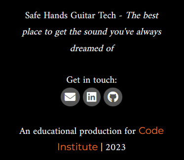
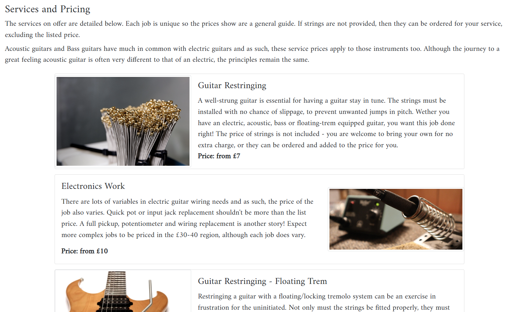

# Safe Hands Guitar Tech Website

[Click here to view the deployed site!](https://pp4-safe-hands-guitar-tech.herokuapp.com/)

  
Click to reveal QR code for easy mobile access!

  

## Introduction

Welcome to the documentation for Safe Hands Guitar Tech! Here we will take an
in-depth look at the process undertaken to deliver the project, from inception
to deployment.

The project is a database-backed Model-View-Template (MVT) full-stack application,
powered by the Django framework. This is similar to the [MVC](https://developer.mozilla.org/en-US/docs/Glossary/MVC)
design pattern. The excellent [MDN Django Tutorial](https://developer.mozilla.org/en-US/docs/Learn/Server-side/Django/Introduction)
outlines the Django MVT pattern as follows:

This application allows for Create, Read, Update and Delete (CRUD) functions. At
the heart of this is the Model, or representation of the database tables. Django
interacts with the database by way of an [Object Relational Mapping (ORM),](<https://www.freecodecamp.org/news/what-is-an-orm-the-meaning-of-object-relational-mapping-database-tools/#:~:text=Object%20Relational%20Mapping%20(ORM)%20is,(OOP)%20to%20relational%20databases.>) that connects Django's Python code to the
relational database used for storing the site's back-end data.

We will examine in-depth how the Models for the site were constructed. In short,
Python code is used to create custom objects, which Django converts to [Structured Query Language (SQL)](<https://aws.amazon.com/what-is/sql/#:~:text=Structured%20query%20language%20(SQL)%20is,relationships%20between%20the%20data%20values.>)
commands that the configured relational database uses to construct its tables.

## Agile methodologies

[Agile methodologies](https://www.atlassian.com/agile) were used across the full
development cycle. This is a project management approach that breaks the project
down into phases, with well-defined, weighted tasks to complete in the given
period. It emphasizes continuous improvement through a refining process and has
the flexibility to welcome change if it meets the goals of the project.

Practice of agile methodologies has been evidenced using GitHub's built-in tools.
Namely, the Issues, Milestones and Projects systems. The level of decomposition
for agile items, from biggest to smallest are:

1. Epics - An overarching collection of stories to implement a feature, or collection of features
2. User stories - Stories told from the perspective of a certain user of the site. What do they want and why?
3. Tasks - The actual work that must be undertaken to fulfill the user story
4. Acceptance criteria - An objective metric to assess the completion of a user story

Here is the breakdown of the tools available on GitHub to present each agile
component.

- [Issues](https://github.com/jts272/pp4-safe-hands-guitar-tech/issues) is where
  each individual agile item is created, often using an issue template. First, an
  Epic is defined which states a big feature of the project too large to be broken
  down. Stories are then created from different perspectives that clarify what
  users actually want. Each story is given a set of tasks to be done to make the
  story happen, and acceptance criteria to test their validity.

- [Milestones](https://github.com/jts272/pp4-safe-hands-guitar-tech/milestones)
  are used as collections of agile items. For example, milestones are created for
  each iteration, which is a timeboxed period where certain stories are planned to
  be completed. As a best-practice, timeboxes do not contain more than 60% of their
  items as 'should have' on the [MoSCoW priority level system.](https://en.wikipedia.org/wiki/MoSCoW_method)
  Milestones are also used to hold [Product Backlog Items (PBIs),](https://github.com/jts272/pp4-safe-hands-guitar-tech/milestone/1)
  which is where items are stored before being passed to a given iteration.

- [Projects](https://github.com/jts272/pp4-safe-hands-guitar-tech/projects?query=is%3Aopen)
  are utilized as information radiators for an instant view on an iteration's progress.
  These are best viewed in Board view with the Label field enabled. Here is the
  board for the [first iteration](https://github.com/users/jts272/projects/7/views/1?layout=board&visibleFields=%5B%22Title%22%2C%22Assignees%22%2C%22Status%22%2C%22Labels%22%5D)
  as an example. This follows the kanban style whereby an item is brought in as
  a Todo item. It then moves to In Progress when it is being worked on, then
  finally Done once all tasks and acceptance criteria have been met.

Below is an example index card for an item found on the project board:

We see that it is a designated story with a title. Each story is linked to an
Epic. This example shows a user story from the perspective of the site admin -
what they want to do and how it will benefit them. We then see the tasks that
must be completed to bring this story to fruition. The acceptance criteria are
tests that must pass to meet the definition of done.

In the right-hand panel, labels are visible for the MoSCoW priority level and
a story point (SP) estimation. These are estimates of effort, assigned using a
[modified Fibonacci](https://www.mountaingoatsoftware.com/blog/why-the-fibonacci-sequence-works-well-for-estimating) weighting scale.
The milestone or timebox the issue belongs to is shown, as well as its status.

Note that Done items are moved by GitHub to the [closed](https://github.com/jts272/pp4-safe-hands-guitar-tech/issues?q=is%3Aissue+is%3Aclosed)
category. This is the same for completed [iterations](https://github.com/jts272/pp4-safe-hands-guitar-tech/milestones?state=closed)

Agile practices help both the developers and product owners. The goals are always
visible, along with the tasks required to achieve them. By using these tools, the
needs of the users are always put first, which guides development to its essential
target. I invite you to explore each milestone to see what was achieved.

---

## Five stages of UX design

The five stages of user experience (UX) design is the pattern that was employed
to bring this project's vision to life. Starting with high-level business needs,
it drills down to the specifics of the what, why and how of each required element
found in the final product.

### 1. Strategy

This project is built from the perspective of a small business owner who wants a
website to attract customers to his [Guitar Tech](https://en.wikipedia.org/wiki/Guitar_tech)
business. The owner will also function as the site's admin for CRUD functions
relating to blog posts, services and setup jobs. The site operates on B2C model,
whereby the product owner advertises his services to private customers.

To meet its business needs, the site needs to display certain information.
Visitors would expect to instantly get an impression of what the site is about
on first glance, with intuitive navigation. Service prices need to be easy to
find. Furthermore, the site content needs to be engaging enough to retain viewership
and help to grow the business.

As the key stakeholder, I conducted an existing product audit on the following sites:

- [Northwest Guitars](https://northwestguitajackrs.co.uk/)
- [Jim's Guitar Workshop](https://jimsguitarworkshop.co.uk/)
- [Fraser Callum](https://fcstrings.com/)

This informed me of scope expectations, which are explored in the next stage of
design.

### 2. Scope

The first objective of scope is to work out the [Minimum Viable Product (MVP)](https://www.productplan.com/glossary/minimum-viable-product/) so that there is a clear set of goals to bring a working
product to market. This is intertwined with the agile methodologies outlined
previously, which adds varying perspectives to the needs of the project.

A blog was to be included from the beginning. This helps to build trust and
engagement for users. They can see that the owner knows their trade and maps
common guitar-related scenarios to jobs he can help with. Users can engage in
the conversation with comments and likes. For this, relevant content must be
produced for site visitors.

Naturally, the services on offer must be detailed, with prices included. This
feature was designed to be easily updated by the owner in the event that prices,
service details or even available services changes.

The [Unique Selling Point (USP)](https://en.wikipedia.org/wiki/Unique_selling_proposition)
of this application is the setups section. Here, the owner can proudly display
their work on past customers' instruments, with a detailed specification breakdown.
This offers a unique value proposition as an app within the project, which requires
a highly customized data model.

A testimonials section for registered customers had been considered early on,
similar to that of [Fraser Callum's.](https://fcstrings.com/testimonials/)
However, I had decided to focus on the blog, service information and the unique
setup feature as I believed these features would have the biggest impact.

As a final functional requirement, there must be a way for customers to contact
the owner to book in their service. This is achieved through the contact buttons
at the footer of every page. An email contact form had been considered, although
on inspection, it would have required setup in Django beyond the scope of the
three iterations allotted to this project.

By examining the [Project Boards](https://github.com/jts272/pp4-safe-hands-guitar-tech/projects?query=is%3Aopen)
and [Milestones,](https://github.com/jts272/pp4-safe-hands-guitar-tech/milestones?state=closed)
a clear link between project scope and deliverable items is seen. As an example,
the first iteration was geared towards achieving MVP blog functionality. The
second focussed on customer/business features. Agile keeps scope creep at bay,
with a clear focus on the essentials. The end result of this approach is a product
that meets the needs of the business, whilst being concise enough for visitors
to navigate fluently.

### 3. Structure

Structure concerns organization of site functions. This is represented in the
concept of [Information Architecture (IA).](https://www.usability.gov/what-and-why/information-architecture.html)
This translates to providing the user with key information where they are, what
they can do and what to expect. This is encapsulated by the implementation of
strong [Interaction Design (IXD),](<https://www.interaction-design.org/literature/topics/interaction-design#:~:text=Interaction%20Design%20(IxD)%20is%20the,output%20to%20suit%20precise%20demands.>)
whereby features are implemented with consideration for _how_ they will be used.

Key components of IXD employed are intuitive navigation, that never requires
guesswork from the user. Feedback is delivered on all actions, from form validation
to success messages.

User's expectations are met whilst browsing through the use of templates. In other
words, elements like navigation and footers stay consistent across pages, with
relevant page content in the middle. A common pattern Django is great for is that
of list-view to detail-view. Put simply, a user finds a list of records on a
given topic, which they can click to access a more detailed view of that record.
This pattern is utilized to great effect in the blog and setups sections.

In keeping with intuitive navigation, errors are handled gracefully, whether client
or server-side. Examples include 404 error handling or presence testing a model
for content and reacting accordingly. Both examples are explored in their relevant
features section.

### 4. Skeleton

In the skeleton phase, we give form to function by way of the User Interface (UI).

Navigation is the first concern when a user visits the site. The brand name is
the first feature, which follows convention by serving as a link home. Then follows
the sections for blog, services and setups.

This tells a story in that the user reads a blog post that catches their interest.
From there they decide to check out the service prices. Then they can check records
of past services from satisfied customers.

On the far side of the navbar is authentication information. A first-time user
can clearly see that account registration is a feature - the gateway to interaction
with the site's content.

From the moment the visitor first lands on the page, they instantly gain an impression
of what the site is about. A familiar image of a Fender Stratocaster greets them.
A bullet-pointed list shows key jobs that are undertaken by the business owner.

An accordion invites user interaction - do they identify with one of the use-cases
and could they benefit from the services on offer? This is followed by a brief
text summary of the key points to visit on the site and why the visitor might
want to go there. Finally an invitation is made to get in contact using the
social call-to-action (CTA) buttons.

The following section highlights the five most recent blog posts, with counters
for likes and comments. This lets users know there is room for interaction. A
brief excerpt is show to capture their attention for reading the specific blog
post in full.

The following wireframe mock ups were constructed to visualize how this information
may appear on the screen. One of the design philosophies implemented was that of
[Mobile First,](https://www.browserstack.com/guide/how-to-implement-mobile-first-design)
which considers the smaller screen before the larger one. In this approach, the
elements are displayed in such a way that mobile users do not have to compromise
on content. From there, the elements can be positioned in such a way that they
can take advantage of ever-increasing screen sizes.

The mockups here target a desktop view, as this presents the information in a more
straightforward way. In the mobile view, elements stack vertically with no loss
of information.

  
Homepage

  

  
Services

  

  
List view for Blog and Setups

  

  
Blog detail

  

  
Setups detail

  

Wireframe images were produced with [draw.io desktop](https://github.com/jgraph/drawio-desktop/releases/)

### 5. Surface

The surface stage concerns the details of how the above elements are presented
to the user. This involves the 'look-and-feel' and ultimately, whether the product
feels valuable. Let's examine each practical element's rationale.

#### Colour

Colour palette image generated at [coolors.co](https://coolors.co/palettes/trending)

I chose to keep things very simple for colours. As stated in Peter Kent's
[SEO for Dummies,](https://www.goodreads.com/book/show/4077.Search_Engine_Optimization_for_Dummies?ac=1&from_search=true&qid=i1EHL1RSSR&rank=1)
'Google likes black text on a white background'. As this site is text-heavy I wanted
to keep things legible and let the content do the talking.

I chose a deep red, which is the business owner's brand colour. Red is classically
associated with guitars, as evidenced in the sites from the existing product audit;
not to mention [Fender's](https://www.fender.com/en-GB/start) website.

[Bootstrap 4 colours](https://getbootstrap.com/docs/4.6/utilities/colors/#background-color)
were used on semantic navigational buttons. Deletion actions were coloured red,
for example. Slight adjustments were made in CSS to ensure these elements met
acceptable contrast ratios. Sadly, they do not meet these standards out-of-the-box.

#### Typography

Two fonts were used on the site. [Satisfy](https://fonts.google.com/specimen/Satisfy?query=satisfy)
is a cursive font, for a handwritten feel on the brand name, such that might be
used if the guitar tech was writing notes. This was given a drop shadow effect
to add depth.

A serif font, [Amiri,](https://fonts.google.com/specimen/Amiri?query=amiri) was
used for all other text content. I had originally intended to use
[Palatino Linotype,](https://learn.microsoft.com/en-us/typography/font-list/palatino-linotype#style--weight-examples)
however this was not available as a Google Font, which is great for use in web design.
The Amiri font exudes an air of experience and knowledge, making for a pleasant,
book-like reading experience. Of note is that serif fonts aid in [reducing fatigue](https://www.ncbi.nlm.nih.gov/pmc/articles/PMC4612630/#:~:text=%E2%80%9CSerifs%20have%20an%20important%20role,the%20location%20of%20stroke%20ends.)
when reading large sums of text.

#### Imagery

Stock image sites such as [Pexels](https://www.pexels.com/) and [Freepik](https://www.freepik.com/)
were used to capture some of the web-friendly quality images used on the site.

The hero image instantly captures the attention of guitar players of any level,
whilst blog posts are adorned with featured images to illustrate their point.

Images on the setups section were take from the business owner's personal
collection, using an iPhone camera.

Of note is that all images uploaded to the site feature dynamic alt tags for
assistive technologies. This is achieved through either direct input at the
image capturing phase (such as in the admin panel), or is generated by model
methods as seen for the images in the setups section.

#### Text content

All blog content has been written by the owner for display on the site. For a
similar example, see [Jim's Guitar Workshop Blog](https://jimsguitarworkshop.co.uk/blog/)

Service content was drafted by the owner to outline his current services and prices.

Setup specification content is also carefully captured by the owner to show the
before-and-after states of his work.

#### Responsive design

These elements culminate in a fully responsive, accessible package to present
all desired information to the user. UX testing has shown a great response to
the deployed design, with user feedback suggestions implemented where possible.
One such example is directing the user to points of contact for the business owner.

---

## Features

In this section, the implemented features of the site are explored in more detail.
Where there are notable differences, both the desktop an mobile version are presented.

### Navigation

#### Desktop navbar and hero image

The navbar includes the brand. This links home in all pages. Links to the three
main sections of the site follow. On the far side of the navbar are the authentication
controls, which always report the login status of the user.

#### Mobile navbar and hero image

In the mobile view, the brand text is reduced to avoid a layout shift. In this
example, the admin user is logged in. The hero image is fully responsive across
screen sizes

### Footer

#### Desktop footer

The footer features a tagline, social contact CTA's and a 'copyright' mark. In
mobile view, these three components are stacked

#### Mobile footer

### Homepage

The homepage displays introductory text to let the visitor know what the site is
about. A list shows some common services. An accordion is used to solicit some
interaction with the content to draw the potential customer in. Further below
are some brief highlights of the different sections of the site, and finally an
offer showing how to get in contact.

The right sidebar shows the five most recent blog posts. An excerpt invites the
reader to select a topic to read that they find intriguing.

### Blog

#### Desktop blog list

On entry of the blog section, the user is presented with a list view of blog posts.
These are paginated in groups of two, allowing full navigation across all published
blog posts. Like and comment counts are shown, as well as a link to read the topic
in full. A link home is provided for when the user is finished with this section

#### Mobile blog detail

A detailed view of the post includes the title, featured image and body text.

#### Desktop blog comments

At the end of the post, logged in users have access to the comment box where they
can leave a comment to be approved by the author. Also shown is the heart icon,
which users can click to like a post.

### Services

As the name suggests, the services are shown and have corresponding prices. A little
more detail is given on the nature of the job, with an accompanying image.

### Setups

#### Desktop setups list with permissions

Similar to the blog list view, this pattern is used for the setups section and
functions in the same manner. If logged in as an admin, the button to create a
new job is present.

#### Desktop setups detail top

#### Desktop setups bottom with permissions

The setups detail page is a long list of before and after specifications for the
guitar that has been worked on. This contains all the setup minutiae that is
covered in the Models section.

Admin has access to controls to update or delete the setup that is being viewed.

#### Setups form top

#### Setups form middle

#### Setups form bottom

The examples show the top, middle and bottom of the form, with controls to submit
the form at the bottom.

---

## Authentication

~ Role-based login; content restriction
~ Login state shown

### Levels

~ Admin
~ User

### Abilities

~ Admin panel; creating blog posts
~ Commenting, liking

---

## Data modelling

~ How Django models create database structure (OOP)
~ Interaction between tables
~ Database configuration

![Initial schema]
![Production schema]

### Blog model

~

### Testimonials model

~

### Guitar spec model

~

---

## Testing

~ Automated and manual as appropriate
~ Coverage
~ Images of test file ran

### Python testing

~

### JavaScript testing

~

### UX/story testing

~ How this relates to acceptance criteria (stories must pass before being completed)

---

## Validation

~

### HTML validation

~

### CSS validation

~

### JavaScript validation

~

### Python validation

~

### WAVE accessibility validation

~

### Lighthouse reports

---

## Version control

~ Git best practices
~ Clean code

## Deployment

~ All steps and services to register
~ Procfile, requirements.txt

## Cloning and Forking

~ Cloning
~ Forking

## Technologies used

~ Hardware: Screens, devices
~ Software: linters, extensions, WSL2

## Additional credits

~

## Closing words

~
